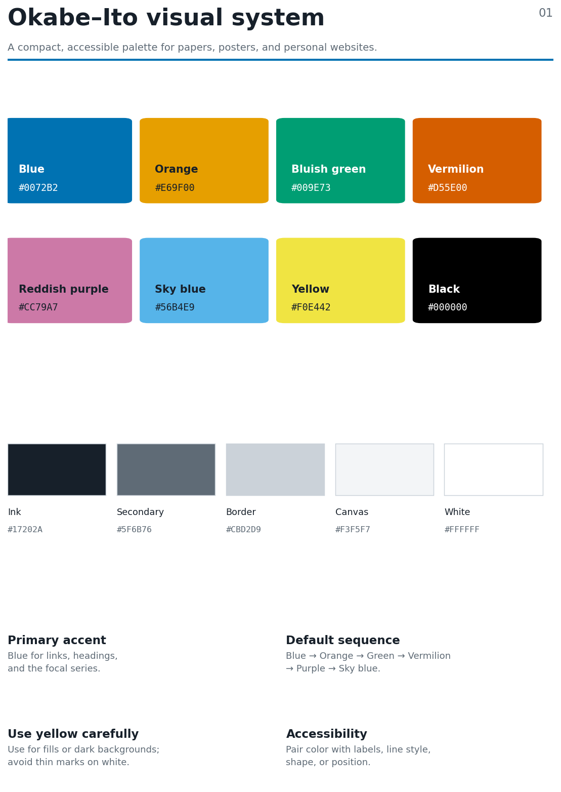
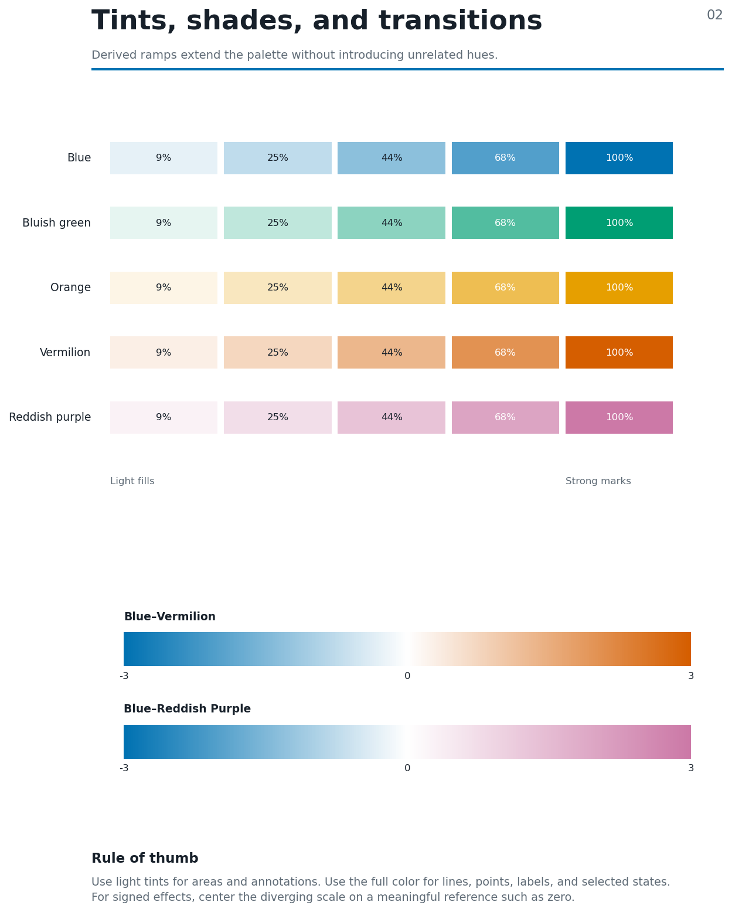
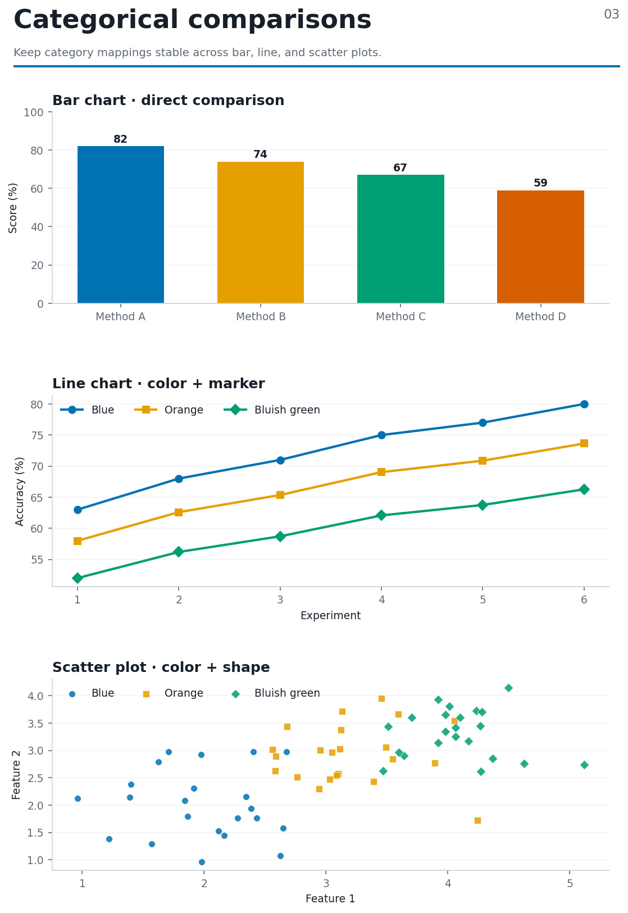
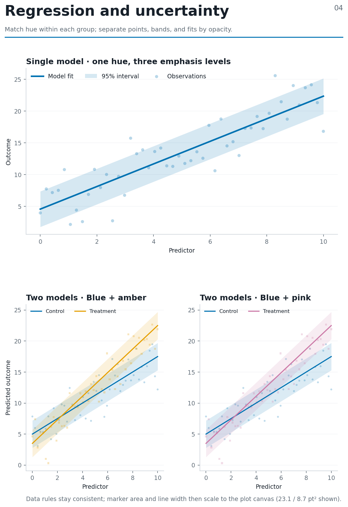
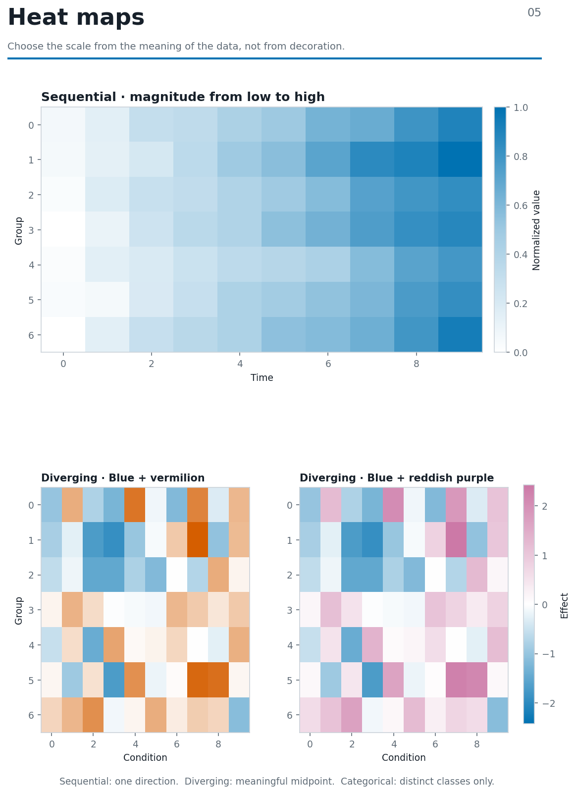
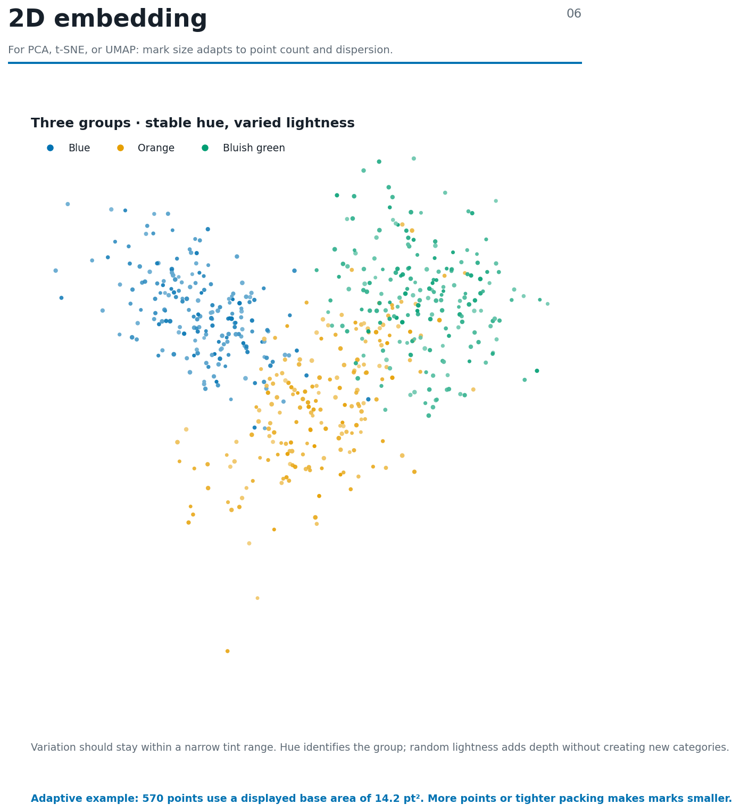
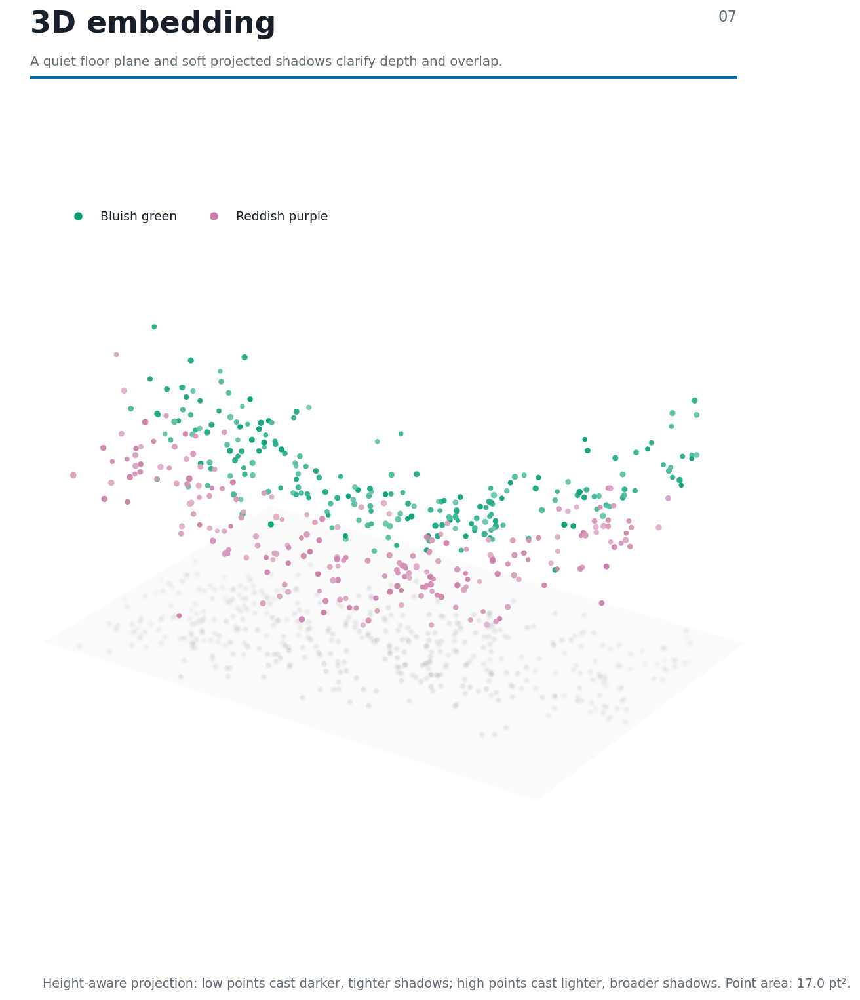
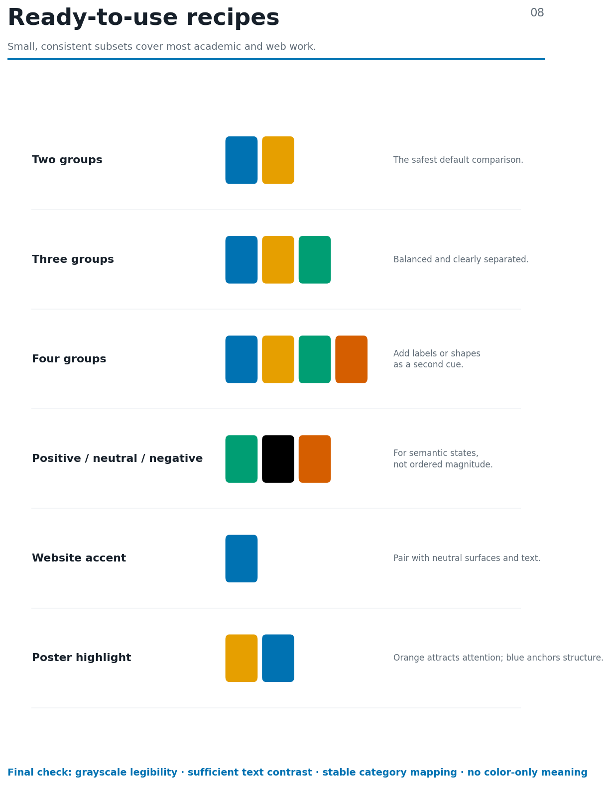

# Bunny Palette

An Okabe-Ito visualization system for papers, posters, and personal websites.

This package is the exact implementation of the approved eight-page visualization guide. Treat `make_palette_guide.py` as the canonical source. Do not infer new colors, replace the interpolation method, change random seeds, or normalize chart geometry differently.

## Screenshots

Previews of all eight pages generated by `make_palette_guide.py`.

| Palette and neutrals | Tints and transitions |
|---|---|
|  |  |

| Categorical charts | Regression and uncertainty |
|---|---|
|  |  |

| Heatmaps | 2D embedding |
|---|---|
|  |  |

| 3D embedding | Palette recipes |
|---|---|
|  |  |

## Reproduce the document

Requirements:

```text
Python 3.10+
numpy>=1.24
matplotlib>=3.7
```

Run from the package root:

```bash
python3 -m pip install -r requirements.txt
python3 make_palette_guide.py
```

The script writes:

```text
output/pdf/okabe-ito-visualization-guide.pdf
```

The random seeds, data generation, layout, typography, colors, transparency, marker sizing, and 3D view are fixed in the script. The generated pages must visually match `okabe-ito-visualization-guide-v20.pdf`.

## Canonical palette

| Name | Hex | Main use |
|---|---:|---|
| Orange | `#E69F00` | categorical comparison, amber regression model |
| Sky blue | `#56B4E9` | secondary categorical color |
| Bluish green | `#009E73` | categorical and embedding group |
| Yellow | `#F0E442` | fills or dark backgrounds only |
| Blue | `#0072B2` | primary accent, control model, negative diverging endpoint |
| Vermilion | `#D55E00` | categorical color, positive diverging endpoint |
| Reddish purple | `#CC79A7` | regression alternative, embedding group, diverging endpoint |
| Black | `#000000` | categorical fallback |

Neutral colors:

| Role | Hex |
|---|---:|
| Ink | `#17202A` |
| Secondary text | `#5F6B76` |
| Border | `#CBD2D9` |
| Canvas | `#F3F5F7` |
| White | `#FFFFFF` |

## Rules that must remain unchanged

### Color derivation

Lightness variation is produced by linear RGB mixing with white:

```python
mixed = (1 - t) * base_rgb + t * white_rgb
```

- General tint levels: 90%, 75%, 55%, 32%, and 0% white mixing.
- 2D embedding random white mixing: 2% to 46%.
- 3D embedding random white mixing: 2% to 44%.
- Heatmap sequential scale: white to a 62% white-mixed blue to the default Okabe-Ito blue.
- Heatmap diverging scales: default Okabe-Ito blue to white to default vermilion or reddish purple.
- Do not darken heatmap endpoints.

### Adaptive marker area

The base marker area is calculated from normalized local spacing:

1. Select the requested dimensions.
2. Normalize every dimension to its observed range.
3. Find each point's nearest-neighbor distance.
4. Take the median nearest-neighbor distance, `d_nn`.
5. Compute `clip(6 + 250 * d_nn, 6, 28)` in points squared.

The final display multiplier is `1.30`.

For regression subplots, marker area is also multiplied by the subplot-area ratio relative to the large single-model panel. Line width is multiplied by the square root of the same area ratio. This keeps the data-based rule consistent while adapting visible components to the canvas.

Current displayed base areas:

| Example | Area |
|---|---:|
| Single-model regression | 23.1 pt² |
| Two-model regression, each small panel | 8.7 pt² |
| 2D embedding | 14.2 pt² |
| 3D embedding | 17.0 pt² |

### Regression

- Observations use the same hue as their fitted model at low opacity.
- Uncertainty bands are transparent and remain behind points and lines.
- The two-model examples are Blue + Orange and Blue + Reddish purple.
- Model identity is reinforced with circle and square markers.

### 2D embedding

- No axes, ticks, or coordinate labels.
- Three groups: Blue, Orange, and Bluish green.
- Point area adapts to count and local spacing, then uses the display multiplier.
- Point lightness varies randomly within the fixed range above.

### 3D embedding

- No axes, ticks, or coordinate labels.
- Two groups: Bluish green and Reddish purple.
- The floor plane is below the point cloud.
- Projected shadows remain inside the floor bounds.
- Shadow opacity and spread depend on point height: lower points cast darker, tighter shadows; higher points cast lighter, broader shadows.
- The 30% point enlargement does not enlarge the projected shadows.

## Page inventory

1. Palette and neutral system
2. Tints and two diverging ramps
3. Categorical bar, line, and scatter examples
4. Regression and uncertainty
5. Sequential and two diverging heatmaps
6. 2D PCA, t-SNE, or UMAP-style embedding
7. 3D embedding with floor projection
8. Ready-to-use palette recipes

## Instructions for a code-generation model

When modifying or translating this implementation:

1. Preserve all palette hex values and semantic mappings.
2. Preserve the random seeds and generated sample counts when exact reproduction is required.
3. Preserve marker areas as areas in points squared. Do not treat them as radii or diameters.
4. Preserve subplot-area scaling for regression panels.
5. Keep heatmap endpoints at the default Okabe-Ito colors.
6. Keep uncertainty bands transparent.
7. Keep embedding axes hidden.
8. Keep the 3D floor and projected shadows below the point cloud.
9. Render all eight pages after changes and compare them with the reference PDF.
